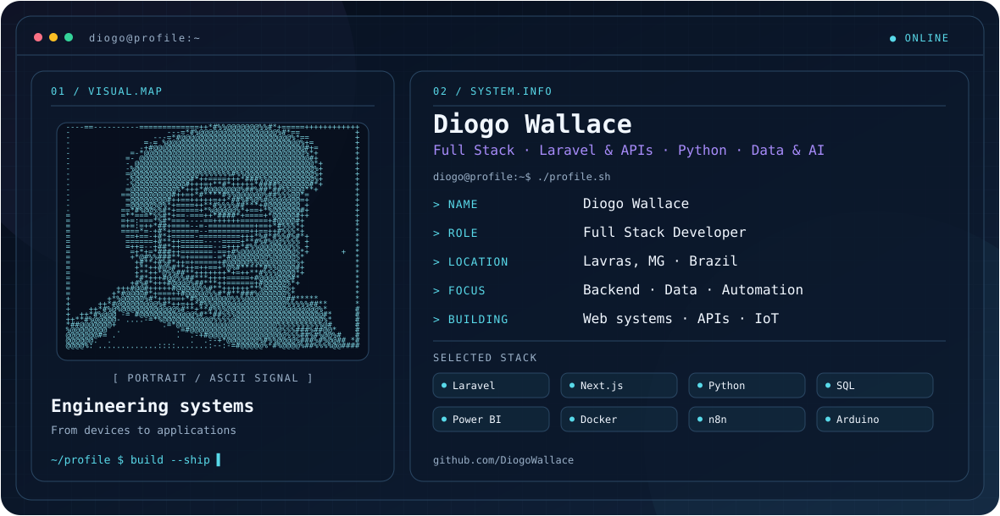

<picture>
  <source media="(prefers-color-scheme: dark)" srcset="./dark.svg">
  <source media="(prefers-color-scheme: light)" srcset="./light.svg">
  
</picture>

**Full Stack Developer · Laravel & APIs · Python · Data & AI Automation — Lavras, MG**

Desenvolvo sistemas web, APIs e automações que conectam software, dados e dispositivos — do microcontrolador ao dashboard.

[Projetos](#projetos-em-destaque) · [Como eu trabalho](#como-eu-trabalho) · [Stack](#stack) · [Contato](#contato)

## Projetos em destaque

### [face-led](https://github.com/DiogoWallace/face-led) — validação facial com prova de vida que acende um LED no Arduino

Microserviço de biometria facial 1:1 com prova de vida ativa própria, ligado por webhook assinado a uma ponte que comanda um Arduino pela serial.

- **Arquitetura hexagonal** com teste que impede o domínio de importar OpenCV, banco ou framework.
- **Webhook confiável:** outbox transacional, HMAC-SHA256 com timestamp e novas tentativas por cerca de 24 h.
- **Privacidade por padrão:** template biométrico cifrado com AES-256-GCM, logs sem imagem nem dado pessoal.
- **Medido, não suposto:** EER de 1,47% no LFW, **377 testes**, **10 ADRs** e uma tabela do que foi e do que não foi verificado.

`Python` `FastAPI` `OpenCV` `PostgreSQL` `Redis` `Docker` `Arduino (C++)`

### [Orbital](https://github.com/DiogoWallace/orbital) — plataforma científica interativa · [no ar](https://orbitalexperiments.com)

Laboratório digital de simulações e análise de dados em física, astronomia e engenharia, com módulos independentes sobre um núcleo comum.

- **Monorepo** com API Laravel 13 e frontend Next.js 16 (RSC + BFF); as simulações rodam no navegador.
- **Dados reais:** pipeline que mede 1.170 alvos do satélite TESS e um classificador que separa planeta confirmado de falso positivo com 76,2% de acurácia balanceada, +6,7 pontos sobre a linha de base.
- **Engenharia de produto:** CI com testes, lint e typecheck no back e no front, imagens publicadas no GHCR e deploy em VPS.
- **Decisões registradas:** 14 ADRs, com as alternativas descartadas.

`Laravel` `Next.js` `TypeScript` `PostgreSQL` `Redis` `Docker` `GitHub Actions`

### [ERP Comercial](https://github.com/DiogoWallace/erp-lambadega) — ERP multi-tenant em produção

ERP para lojas, restaurantes e adegas: cadastros, estoque, PDV, financeiro, auditoria e relatórios.

- **Multi-tenant** por estabelecimento com global scope, UUID v7 em todas as tabelas e RBAC com Spatie Permission.
- **Vendas orientadas a eventos**, com baixa de estoque por lock atômico e fronteiras de camada checadas pelo Deptrac.
- **CI/CD** com GitHub Actions: deploy automático em dev e produção via PR `dev → main`.
- **191 testes** (167 PHPUnit e 24 Vitest).

`Laravel` `PHP 8.4` `MySQL` `Next.js` `TypeScript` `Docker`

## Também construí

Sistemas em uso por clientes, com código privado:

- **Gestão de clínicas de fisioterapia e pilates** — agenda, pacientes e financeiro.
- **Automação de deploy de Power BI** — controla a publicação dos relatórios e o cadastro de clientes.
- **Bots de WhatsApp para gestão de frotas** — consultas de telemetria em SQL Server respondidas no chat ([versão pública](https://github.com/DiogoWallace/bot-python)).

## Como eu trabalho

- **Decisão por escrito:** ADRs com o problema, as alternativas e o motivo da escolha.
- **Teste antes de dizer que funciona**, e documentação do que ainda não foi verificado.
- **Ambiente reproduzível:** tudo sobe com Docker Compose, do banco à fila.
- **Arquitetura que segura mudança:** regra de negócio separada de framework, controllers finos, casos de uso testáveis sem HTTP.

## Stack

| Área | Tecnologias |
|:--|:--|
| **Principal** | PHP · Laravel · Python · FastAPI · TypeScript · Next.js · React |
| **Dados** | PostgreSQL · MySQL · SQL Server · Redis · Power BI · ETL |
| **IA e automação** | LLMs · NL2SQL · n8n · WhatsApp (Meta Cloud API · Evolution API) |
| **Infra e IoT** | Docker · GitHub Actions · Nginx · Linux · Arduino · Webhooks |

## Contato

